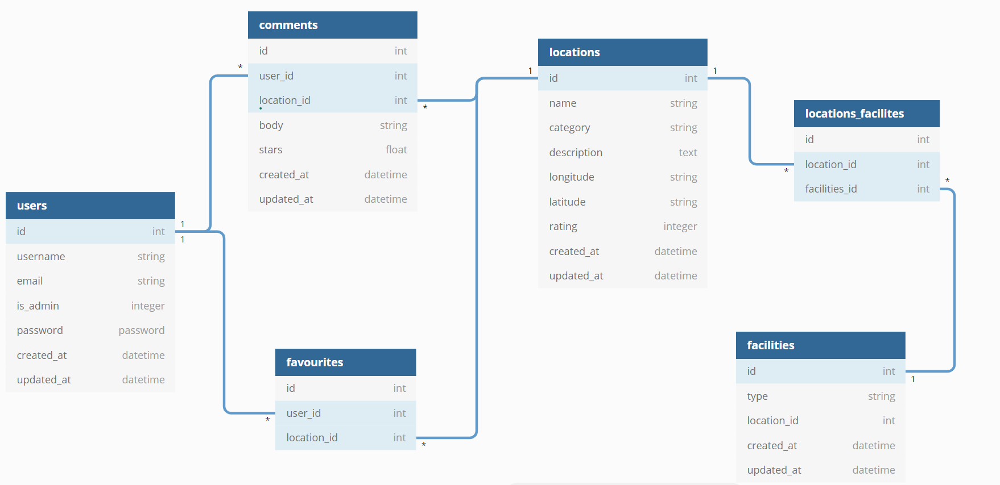
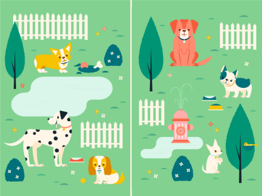
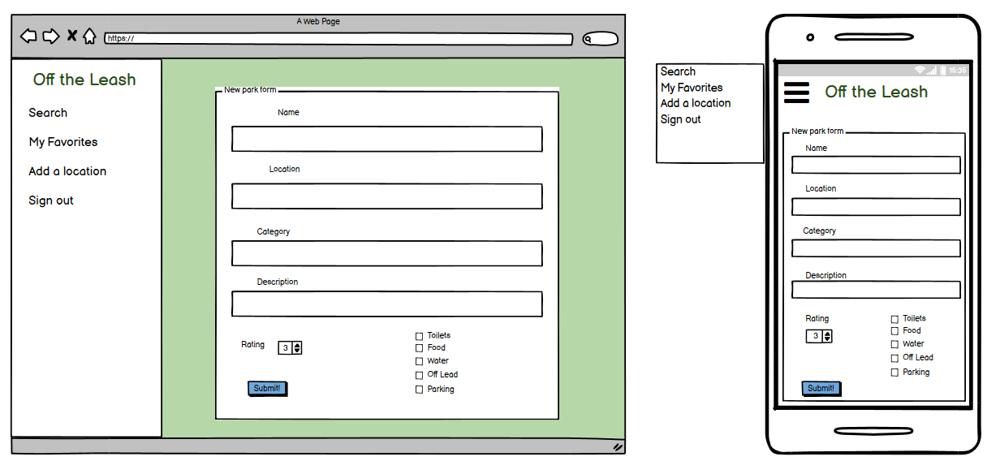
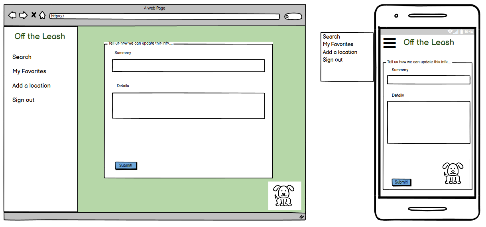
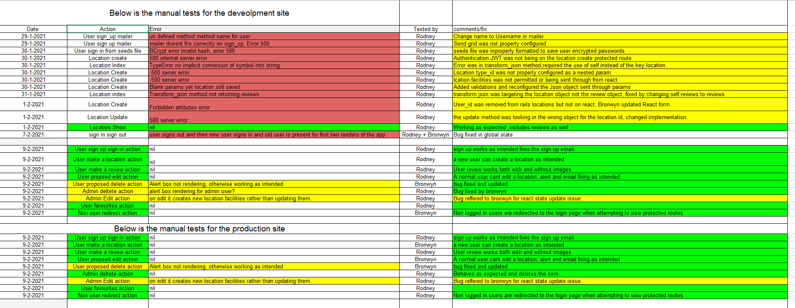
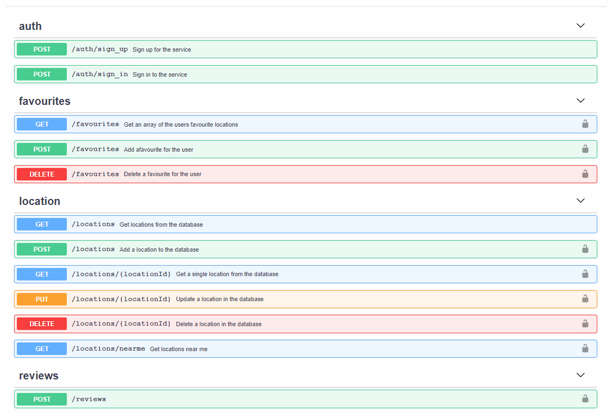

# T3A2 Off The Leash

## Installing the App

### Dependencies

- ruby 2.7.2
- yarn 1.22.10
- node v14.15.1

### Actual install

- Clone both repositories [Front end](https://github.com/bronwyncarr/dog_places_frontend) and [Back end](https://github.com/bronwyncarr/dog_places_backend)
- Run `yarn install` for the front end and `bundle install` for rails then on rails run a `rails db:create` and `rails db:seed`
  From here the app will not work unless you delete the credentials and run `EDITOR='code --wait' rails credentials:edit`
  which will give you a new master key and make knock work.
  this app also uses a google maps api key a sendgrid api key which you will need in the rails credentials for the appto function correctly locally

## How to test

Since the React side of this app takes information from the rails app you will need to run this command to seed the test database `RAILS_ENV=test rake db:test:prepare db:seed` which will seed the test data base and allow you to test both the backend with the pre configured RSpec tests which can be run with `bin/rspec -fd` the -fd here is optional and just gives you more information while the tests run
and the front end can be tested with Cypress by running `yarn run e2e` whilst the rails app is running with this command `rails s -e test`
then just select which test you want to check and see that they all pass and the app is ready to go.

## Links (R10)

- [Off the leash site](https://off-the-leash.netlify.app/)
- [Front end](https://github.com/bronwyncarr/dog_places_frontend)
- [Back end](https://github.com/bronwyncarr/dog_places_backend)

- [Link to Trello Board](https://trello.com/b/113nxQTJ/off-the-leash)
- [Api Documentation](https://documenter.getpostman.com/view/14438308/TW76D4aa#aab65073-7c5a-4cc7-8404-ab6b4eea852a)

## PART A

### ℹ Purpose (R1)

> “Everyone thinks they have the best dog. And none of them are wrong.” – W.R. Purche

Over one third of households in Australia have a pet dog, giving Australia one of the highest rates of pet ownership in the world. That's over 3.6 million households with a dog eagerly waiting at the front door for it's owner, snoozing on the couch in the sun, or chasing a ball around the garden. Dogs are traditionally known as "man's best friend" and many people consider them part of their family. This app is designed to help people include their four legged family member in day-to-day activities in addition to planning outing the whole family can enjoy.

The app is designed to help people find locations and plan activities that are "dog-friendly". This might be an off-lead park, a cafe that welcomes dogs or even to Bunnings for a sausage. Users can search the location of places and see what facilities there are for them and their four legged friend.

### 🌟 Features

Off the Leash will allow users to:

- Search for places that are dog-friendly
- See locations on a map and in a list
- See a description of the place, facilities that are available, images and reviews
- Share reviews and images of places they have visited
- Add new places to the database
- Request admin modify or delete a location from the database

### 🤼 Target audience

The target audience for this app is anyone looking for places that are dog-friendly in some way. They may be looking a cafe close to home they can regularly go to, or further afield if say, they are planning a car trip and after places they can stop to stretch their dogs legs. They may be after an fenced area they can do training, information on off-lead times at a beach or just somewhere to socialise and make friends (2 and 4 legged variety).

Our hypothetical clients could be:

- A city council who wants to provide this service to their residents whilst encouraging responsible dog ownership and generating traffic for small businesses.
- A company who wants to increase their digital presence to customers of their business, for example, large food manufactures such as _Purima_ who want to promote their brand to their target audience, dog owners.

### 💻 Tech stack

#### Front end

- React
- CSS/SASS

#### Back end

- Ruby on Rails API
- PostgreSQL database

#### Third Party

- Geolocation API
- SendGrid/Twillo
- OAuth/JWT

#### Deployment

- Heroku web server for Rails database
- Netlify for React frontend

#### Development/Project Management

- GitHub
- Cypress
- Trello

### 📈 Diagrams

#### Dataflow Diagram (R2)

[Link to Dataflow diagram](https://drive.google.com/file/d/1ZBsxeL0t5O7q6Gafsg9uKJoZUkoQyp6M/view?usp=sharing)

#### Architect Diagram (R3)

#### ERD

[Link to ERD](https://dbdiagram.io/d/600b7dd380d742080a3785d0)

### 📋 Trello board

We used Trello as a project management tool. This helped us visualize our progress, keep track of time spent, and assign priority. We could visually see what each other were working on to stay in touch and review our progress collectively.

Trello Board at the start:

Trello Board part way through:

Trello Board at the end

[Link to Trello Board](https://trello.com/b/113nxQTJ/off-the-leash)

### 🤼 User Stories (R4)

#### Initial MVP

- As a user I want a convenient way to see what facilities are available so that I know what is available.
- As a user I want to see locations of facilities, so I know where it is.
- As a user I want to see facilities on a map so that I can visualize where they are.
- As a user I want to be able to add facilities so that I can contribute to the database.
- As a user I want to be able to request admin edit or delete places so that information is always up-to-date but protected from malicious behavior.
- As a user I want to be able to rate and comment on places so that there is more feedback on the location.

#### A copy of a daily check for User stories can be found in the user stories log tab of the excel spread sheet

[Spreadsheet](docs/OffTheLeashDevLog.xlsx)

#### Stretch Goals

- As a user I want to see the distance of a facility based on my current location so that I know how far it is.
- As a user I want a webpage that is visually appealing with animations so that I enjoy using the website.

### 📐 Wireframes (R5)

Considering our app is about family activities and location to visit with your dog, we decided on a playful theme when designing our wireframes. Our inspiration was:

Source: <https://wearepretendfriends.com/dog-park>

Our wireframes take into account a variety of screen sizes.

Landing Page:

Individual Location:

Index of Results:

Add a New Location:

Request to Modify or Delete an Existing Location:

Submit a Review or Upload Pictures:

## PART B

### Task delegation (R4)

At the beginning of this project we discussed how we were going to work together to maximise our productivity and outcomes for this project. We discussed our:

- strengths
- weaknesses
- skills we would like to improve on
- things we enjoyed
- working styles
- communication styles
- task delegation preferences
- personal commitments and timeframes

Rodney took the backend development and testing to improve his knowledge of database structures and testing practices. Bronwyn took the frontend development because she felt more confident with the React frame work and Javascript overall as well as styling.

We knew there was a limited timeframe so we determined the MVP we wanted to achieve in it. Throughout the project we had to juggle personal commitments such as preparing for internship interviews and plan out time accordingly.

In our initial planning phase we worked out some "minestones" we wanted to achieve on certain dates to ensure we were tracking to complete our MVP within the timeframe.

We held standups over the phone each morning and evening to track our progress, discuss blockers, help troubleshoot and support each other. This allowed us to have a clear plan of attack to accomplish the days work. Not everyday did we complete everything we intended so we discussed it and addressed any blockers that we were facing so we could productively move forward. For example when we couldn't figure out how to wire up the near me function from react to rails we both set about researching query strings and how they worked which led to the search by name function being implemented.

We met in person to discuss our initial concept, planning and develop our wireframes. After that we found phone calls and screen sharing on discord to be the most efficient way to communicate large problems/trouble bugs and for standups. We also kept in regular touch over discord instant messaging to stay in touch and be aware of each other's progress.

### Testing (R8, R9)

#### Daily logs

We conducted manual testing daily to keep track of the status of our application and can be found [online here](https://docs.google.com/spreadsheets/d/1nBkMOCYczEhUjS3Quj4VdaXcq7aJxRsKv7s7-TjV1_o/edit#gid=0)

We tracked the errors recognised through manual and automatic testing and got an external third party to test the site for us and provide feedback. Details can be found [online here](https://docs.google.com/spreadsheets/d/1nBkMOCYczEhUjS3Quj4VdaXcq7aJxRsKv7s7-TjV1_o/edit#gid=0)

- ##### Jan 21, 2021

  Initial Read me was created and base logic for models and relations completed in the back end

- ##### Jan 22 - Jan 25, 2021

  The time between the 22nd to the 25th was spent on making the Part A readme and getting the ERD and application diagrams ready for submission

- ##### Jan 27, 2021

  - Front end:
    - Side bar created
    - Components made for navigation utilizing React-router-dom library
    - Begin fetch calls to rails api integration
  - Back end:
    - Rails api authentication added using the Knock and JWT gems
    - Rails model CRUD implemented
    - Seeds file created for rails database

- ##### Jan 28, 2021

  - Front end:
    - React basic CRUD implemented for Locations
    - Fixed fetch calls to send JWT when accessing protected routes on rails api
  - Back end:
    - Addressed bugs in authentication, was not sending jwt from React on each fetch call which resulted in authentication not working
    - Began investigating Auth0 gem integration

- ##### Jan 29, 2021

  - Front end:
    - Refactored auth fetch call into a reusable function
    - Refactored locations form into a reusable component
    - Investigated Global state implementation for React app
  - Back end:
    - Developed the Transform_json method to be used in all controllers to send back a standard data object for ease of use on React
    - Bullet added and data base queries optimized where possible

- ##### Jan 30, 2021

  - Front end:
    - Comments added to code
    - Authentication further integrated
  - Back end:
    - Favourites and review end points added
    - began testing with http.client file and VScode extension
    - post man requests to ensure the data return was what was intended

- ##### Jan 31, 2021

  - Front end:
    - Username added to state on sign in for use later
    - Usereducer investigated and attempted integration
    - Global context added to site
  - Back end:
    - Auth0 investigated further
    - Send grid integrated
    - Aws integrated

- ##### Feb 1, 2021

  - Front end:
    - Refactored components to outside of app file
    - Sign out component moved into its own file for clarity
    - Protected routes added and conditional rendering implemented to ensure the correct data was being show to the right users
    - New location fetch request revised
  - Back end:
    - Revised end points for rails app
    - Auth0 re investigated , decided it wouldn't be necessary for this application
    - Developed Mailers for user sign up

- ##### Feb 2, 2021

  - Front end:
    - Delete button bug found and referred to backend Dev
    - Place holder search bar added
    - Static assets added to global state
  - Back end:
    - Delete end point bug fixed
    - Developed get_static_assets method to ensure react app only used values available to the data base
    - Added end points for favourites began investigating return values
    - Implemented logic and allowed extra keys through params for ease of data transmission from React app

- ##### Feb 3, 2021

  - Front end:
    - Implemented some conditional rendering through the use of is_admin boolean
    - implemented location presence check to ensure no errors are thrown by react if there are no locations
    - renamed and altered Auth fetch method for consistency
    - Favourite button added
    - Alert added for none admins to send a request to change a location
    - Location average method implemented
  - Back end:
    - Admin boolean added to users model and json payload for React conditional rendering
    - Fixed routes for Reviews
    - Review debugging, adding extra keys and ensuring the reviews get saved
    - Delete user account function added
    - User id removed from locations model

- ##### Feb 4, 2021

  - Front end:
    - Favourites logic implemented
    - Location CRUD refactored into a hook
    - Google map api error checking integrated
  - Back end:
    - Deployed to heroku
    - CORS configuration
    - Favourites controller overhaul, favourites now come through and return the intended data
    - Rspec testing integration

- ##### Feb 5, 2021

  - Front end:
    - JWT decoder added
    - Images added to review form
    - Favicon added
    - Image upload debugging
    - Heart icon added for favourited locations
    - User functions refactored into Hooks
  - Back end:
    - Bugs discovered in Aws config
    - Location strict params removed
    - More RSpec tests!
    - Fixed bugs in deploy, did not have aws sdk gem installed so heroku just crashed
    - Images now attached to reviews and uploading to AWS

- ##### Feb 6, 2021

  - Front end:
    - Cypress integration
    - Reviews given a "max" value
    - Near me function implemented, couldn't get it working without a post request. begin investigating query strings
    - Images removed from locations
  - Back end:
    - More RSpec! Model validations added
    - Near me function currently working but only through a post request
    - Used rails route helpers to gain access to images inside the application record, required default host setup. Don't think its right

- ##### Feb 7, 2021

  - Front end:
    - Cypress tests added
    - Conditional rendering integrated for when a user has no favourites
    - Reducer reconfigured into a single dispatch call
    - Search by name function added
    - Near me method works with query strings
  - Back end:
    - More RSpec tests location requests updated
    - Attempted to re configure the transform_json method to be inside a controller, didn't work out
    - Image bug, works locally but not on heroku? think its to do with the routes i set in the config files...
    - Near me re configured to use query strings rather than POST request

- ##### Feb 8, 2021

  - Front end:
    - Icons added for location facilities
    - image rendering for reviews logic implemented
    - More Cypress tests! admin and regular users testing site end to end tests integrated
    - Site Styling begun
  - Back end:
    - Search bar bug fixed
    - Review image url added to Review get request for use as secondary fetch call on loading a location
    - Google api key updated
    - Rspec tests updated, attempted to integrate Review tests

- ##### Feb 9, 2021

  - Front end:
    - Styles finalized
    - Cypress tests reconfigured after styling blitz
    - Fixed major bug in location edit
    - Documentation Complete!
  - Back end:
    - Fixed minor bug in near me function
    - Fixed major bug in location edit where react was sending too many location facilities
    - Documentation Complete!

#### API Documentation

We used a combination of [Postman](https://www.postman.com/) and the vscode extension [REST client](https://marketplace.visualstudio.com/items?itemName=humao.rest-client) for developing and testing our endpoints. In the early stages of the projects, we determined which API endpoints we would need what data would need to be sent. We followed industry practise and used Open API 3 to document this to create a contract between the front end and the backend. We continued to refine this contract as the app developed. This can be found [online](https://documenter.getpostman.com/view/14438308/TW76D4aa#aab65073-7c5a-4cc7-8404-ab6b4eea852a) and is summarised below.

We created a **client.http file** which can be found in the rails backend and a JSON copy of our postman logs [here](./docs/Off-the-leash-postman-logs.json).

### Libraries and Tools used in the Project

- #### React Testing

  - [Cypress](https://www.cypress.io/) for testing the React end to end intergration testing and over all functionality of the React app.
  - [jackfranklin/test-data-bot](https://github.com/jackfranklin/test-data-bot) for creating randomized seed data.

- #### Front-end functionality

  - [React](https://reactjs.org/) The front end was created with a create-react-app template script. We also used react tools such as react-router-dom, useState, useEffect etc.
  - [Axios](https://github.com/axios/axios) We decided to use Axios rather than simply using the Fetch API because of the way Axios handles errors.
  - [JWT decode](https://yarnpkg.com/package/jwt-decode) We used the JWT decoder package to determine the expirey date. This was used for authentication.
  - [React Google Maps API](https://react-google-maps-api-docs.netlify.app/) We used this package to render the map of the locations. It provides simple binding to the Google Maps JavaScript API.

- #### Rails Testing

  - [Rspec](https://rspec.info/) We used RSpec for testing the Rails API.
  - [Factory bot](https://github.com/thoughtbot/factory_bot) For consistent and usable data for testing.
  - [Byebug](https://github.com/deivid-rodriguez/byebug) We used this for debugging code, Rodney believes it's the most powerful gem he's ever used.

- #### Back-end Core functionality

  - [Ruby on Rails](https://rubyonrails.org/) The framework for the backend written in ruby
  - [Rack cors](https://github.com/cyu/rack-cors) The gem which allows the React app to access the Rails API by configuring the cross origin services
  - [Bullet](https://github.com/flyerhzm/bullet) This gem was used to optimize the database search queries where possible
  - [jwt](https://github.com/jwt/ruby-jwt) While it seems simple on the surface this is half of the overall authentication for the app
    this combined with knock generates a JWT and sends it to the users which is then passed back and forth to access the restricted areas of the site
  - [Knock](https://github.com/nsarno/knock) As stated above this gem works with jwt to provide authentication between the React and rails apps.
  - [bcrypt](https://rubygems.org/gems/bcrypt/versions/3.1.12) This little guy right here is what gives us password security, basically it hashes passwords when it encounters them so that they aren't just out in the open for everyone to see
  - [sendgrid](https://github.com/sendgrid/sendgrid-ruby) While rails can send emails on its own with a little configuration send grid just provides a much easier and cleaner way to do this
  - [aws-sdk](https://aws.amazon.com/sdk-for-ruby/) Since our application had planned to use image uploading in some form through the cloud service of amazon web services this gem allows us to store the image "off site" and keeps our heroku storage lean and leaves more room for data base content!
  - [rubocop](https://github.com/rubocop-hq/rubocop) The code formatter for the ruby language used in this app
  - [rack reducer](https://github.com/chrisfrank/rack-reducer) Allows us to filter the return of a get request by using query strings( its used for the search by location name call in react)
